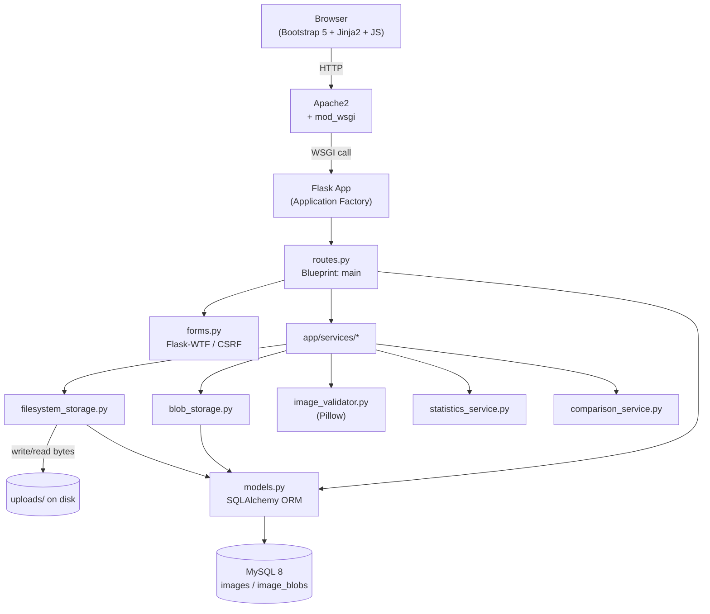
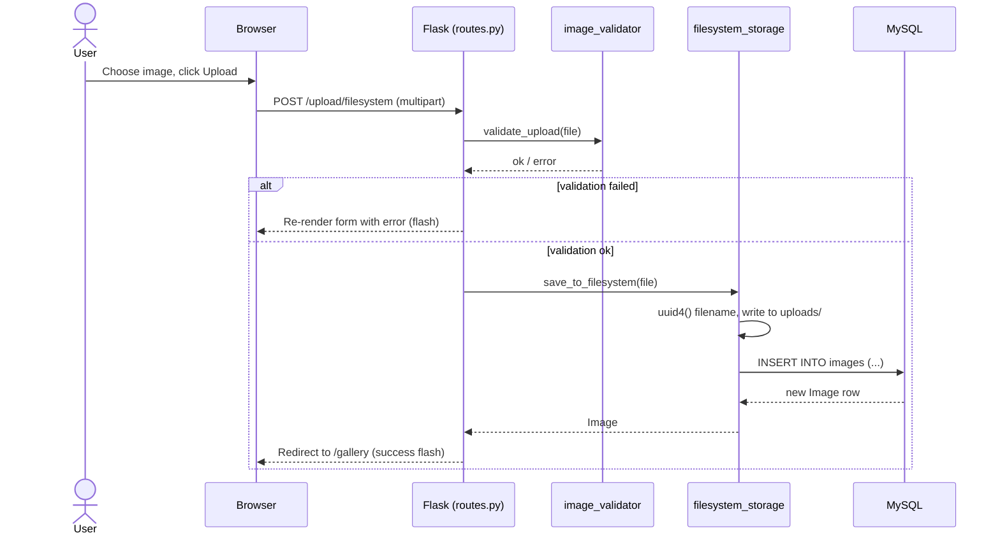
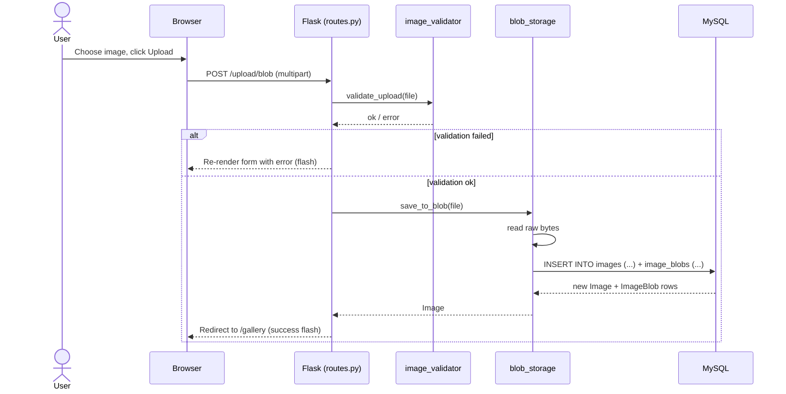
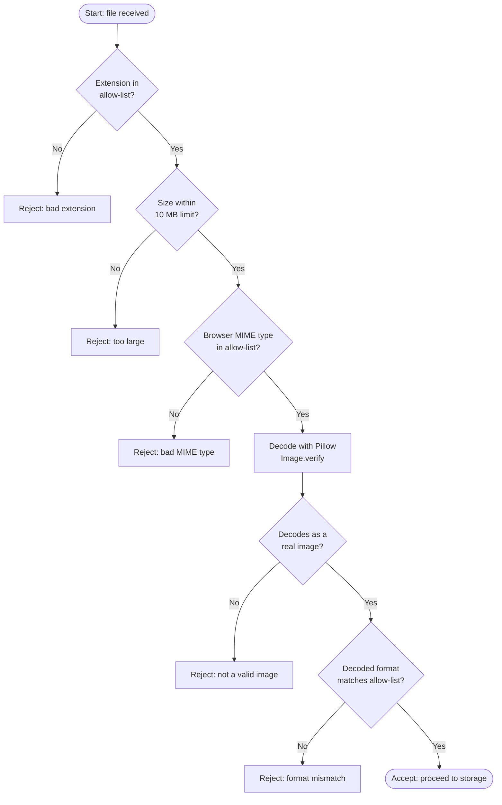

# Architecture Documentation

## 1. System Architecture



## 2. Entity Relationship Diagram


## 3. Folder Structure

```
image-storage-demo/
├── run.py                     # Dev server entry point
├── config.py                  # Environment-based configuration
├── requirements.txt
├── install.sh                 # All-in-one installer: deps, DB, migrate, smoke test
├── scripts/
│   └── smoke_test.py          # End-to-end test invoked by install.sh
├── database/
│   ├── schema.sql             # Raw MySQL DDL
│   └── seed.sql                # Illustrative demo rows
├── deployment/
│   ├── apache/
│   │   ├── image-storage-demo.conf
│   │   └── image-storage-demo.wsgi
│   └── mysql/
├── app/
│   ├── __init__.py            # create_app() application factory
│   ├── models.py               # Image, ImageBlob SQLAlchemy models
│   ├── routes.py                # HTTP routes (Blueprint: main)
│   ├── forms.py                 # Flask-WTF upload form
│   ├── extensions.py            # db, migrate, csrf singletons
│   ├── services/
│   │   ├── filesystem_storage.py
│   │   ├── blob_storage.py
│   │   ├── image_validator.py
│   │   ├── statistics_service.py
│   │   └── comparison_service.py
│   ├── templates/
│   └── static/
└── docs/
```

## 4. Upload Workflow (File System)



## 5. Upload Workflow (Database BLOB)



## 6. Activity Diagram (Validation)



## 7. Flask Application Flow

1. `run.py` (dev) or `deployment/apache/image-storage-demo.wsgi` (prod) calls `create_app()`.
2. `create_app()` loads `Config` from environment variables, initializes
   `db`, `migrate`, and `csrf`, registers the `main` blueprint, and installs
   error handlers (413 / 404 / 500) and rotating-file logging.
3. Each request enters through `app/routes.py`, which delegates all
   business logic to `app/services/*` and never touches SQLAlchemy models
   or the filesystem directly for anything beyond simple lookups.
4. `app/models.py` defines the two tables described in the ERD above.
